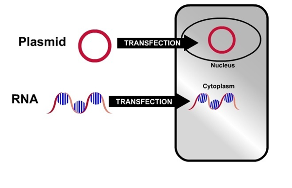

### Theory   

Transfection is the process of introducing foreign molecules and genetic materials into eukaryotic cell. The term transfection is commonly used for non-viral methods of gene delivery in eukaryotic cells. Transfection is an important research tool to study gene function and protein expression in the cell. Transfection is commonly used in biological laboratories for studying, modulation of gene expression, gene function, gene regulation, protein expression, biochemical mapping, mutational analysis and protein production.  

   

Based on the application two main types of transfections exist, transient transfection and stable transfection. Transient transfection is the transfection in which the foreign DNA is eliminated by the cell prior to or during mitosis. Thus, the foreign DNA does not carry over to the new cell and they are unaffected. Whereas in stable transfection is the form of transfection in which the foreign DNA becomes  parts of the cell original DNA by either adding on to it or replacing the old DNA to create new DNA strand. This is a rare occurrence, as well as eliminates the new material sometimes after it enters but before the cell forms new cells.

Based on the strategies, the tansfection methods can be divided into three groups:

1.    Methods that rely on carrier molecules

2.    Methods that deliver nucleic acids directly to the cytoplasm

3.    Methods that employ viral vectors
 
Transfection using calcium phosphate was one of the earlier methods developed in order to introduce foreign molecule to a cultured mammalian cell. In this method, calcium chloride containing HEPES-buffered saline solution is used to deliver plasmid DNA. Development of lipid and polymer-based carrier molecules having capacity to bind nucleic acids led to the adaptation of these compounds in transfection. Liposomes formed from these compounds are able to fuse with cellular membranes by which they can deliver bound DNA or RNA to the new cell. Recently, developed non- liposomal and some polymers are capable to forming complex with DNA or RNA and have potential to form micelles. The transfection reaction is commonly performed under aqueous conditions which help the lipophilic portion of the amphiphilic compound to form the micelle core within which the exogenous nucleic acids are settled. Superior transfection efficiencies can be achieved in the cell lines that are refractory to liposomes-based transfection.
 

Some of the problems associated with traditional transfection methods like calcium phosphate coprecipitation, DEAE- dextran, polybrene and electroporation, include low efficiency of DNA delivery, poor reproducibility, cell toxicity and inconvenience. The cationic lipid reagent- mediated transfection yields high and previously unattainable transfection efficiencies in a wide variety of eukaryotic cells. It is simple to perform and ensures consistently reproducible results. Moreover, a number of cell lines normally resistant to transfection by other methods transfect successfully using cationic lipid reagents.

The principle of delivery using cationic lipid reagents thus differs from prior attempts to use neutral liposomes for transfections. With cationic lipid reagents, the DNA solution is not deliberately encapsulated within the liposomes, rather, the negatively charged DNA binds spontaneously to the positively charged liposomes, forming DNAâ€â€Cationic lipid reagent complexes.

Transfection reagents are a carrier for DNA that researchers can use to insert the DNA into cells in culture. Transfection of adherent cells using various agents such as lipofectamine (Invitrogen) requires optimization of amount of plasmid or reagent and cell number and specific for cell type. These molecules can work in several different ways to carry DNA into the target cells and insert it into their genome. The typical process involves mixing the desired DNA with the reagent, adding it to cells in ÂÂÂ-culture, incubating them, and then identifies them, which contain the new DNA.

The use of viral DNA vectors as well as mechanical methods like microinjection, where the desired DNA is directly injected to reduce the risk of degrading the material. Gene guns are another popular tool for DNA transfection.

